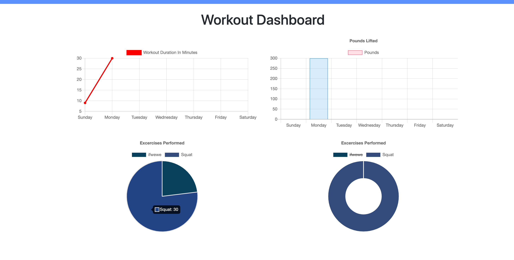

# workout-tracker
Using mongoDB we are learning about new forms of storage that is DOM orientated. With experience with a similar DOM orientated database, mySQL, we are implementing mongoDB to a fitness tracker that stores workouts in the MongoDB database. This fitness app allows the user to generate a workout based on two categories, Resistance and Cardio. Selecting Cardio you are prompted with cardio based inputs. From type of cardio, to distance. Same goes for resistance. 
# Site pictures

# Getting started
With a basic develop structure we are prompted to create a mongoDB that associates the data received from the client-side to the mongoDB. It requires a set of npm packages to function. Mongoose, express, and morgan. Morgan works as a HTTP request logger middleware for node.js. Express allows for server communication by enabling code with server functionality. Mongoose allows for mongoDb object modeling. It supports both promises and callbacks.

## Authors

* Daniel Jauregui

## Deployed Link

* [Link to repo](https://github.com/Kionling/workout-tracker)
* [Link to Deployed Site](https://kionfitness.herokuapp.com/)